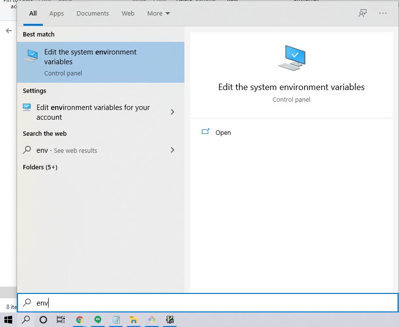
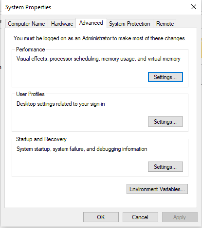
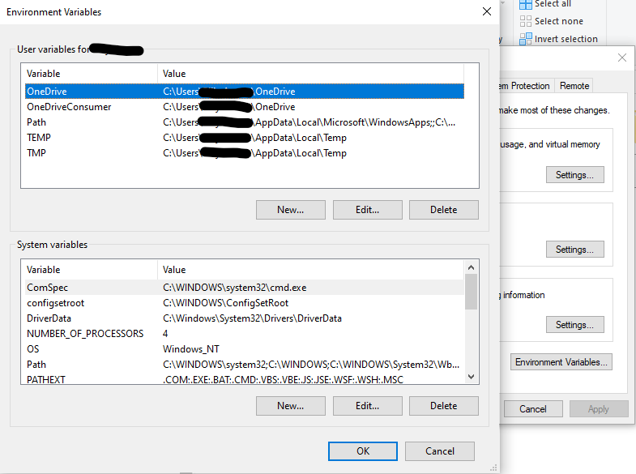
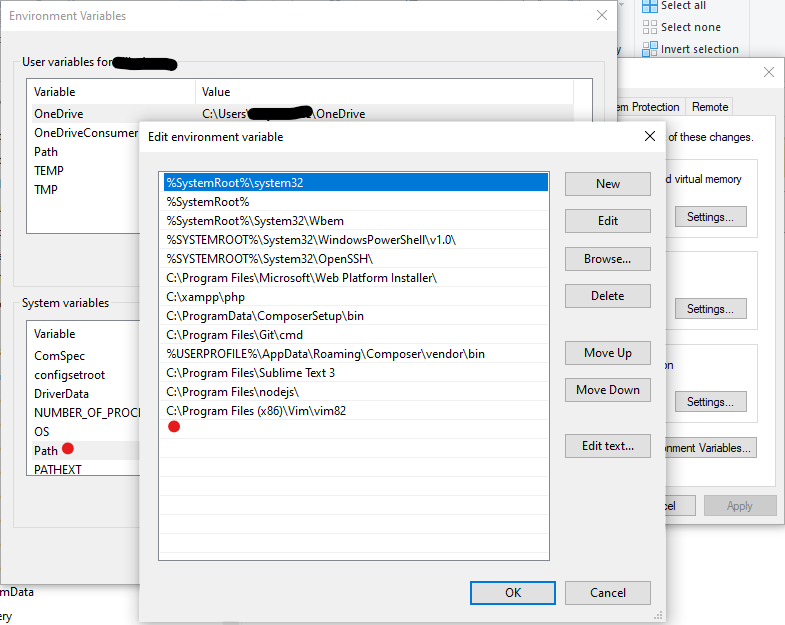
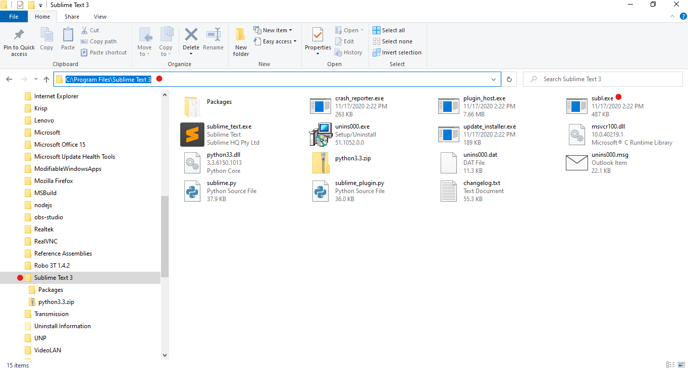
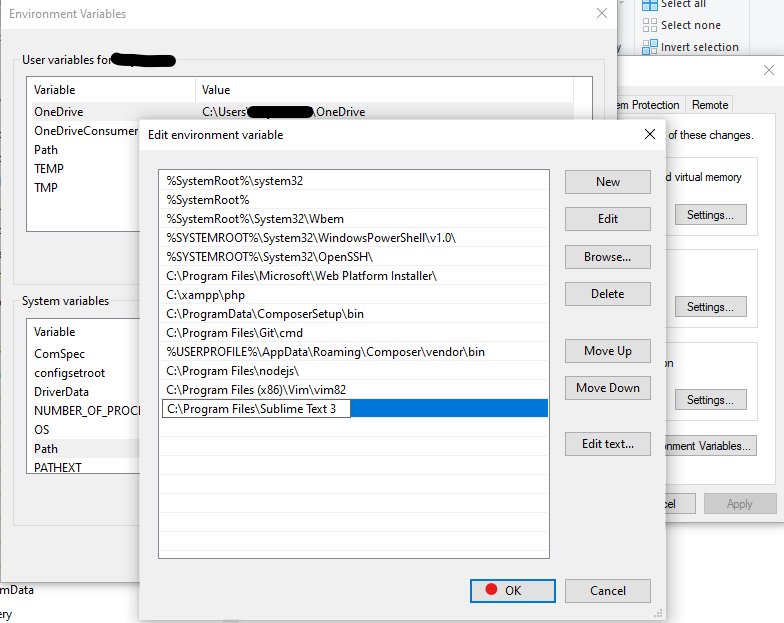

# How to add `subl` (Sublime Text) to Windows systems variable `PATH`?

- Open the `System Properties` application.

- Click on the `Environment Varibles...` button.

- In `System variables` section, double-click on `Path`.

- In `Windows Explorer` application, navigate to the directory of the Sublime Text installtion files.

- Copy the absolute path of Sublime Text.

- In `Edit environment variable` window, double-click on a new line at the bottom of the list.

- Paste the absolute path of Sublime Text.

- Click all of the `OK` buttons of the open windows to apply the changes.

- NOTE: If a `Git Bash` application is open, you must restart it to refresh the configurations.
